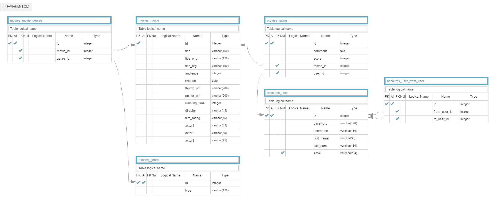
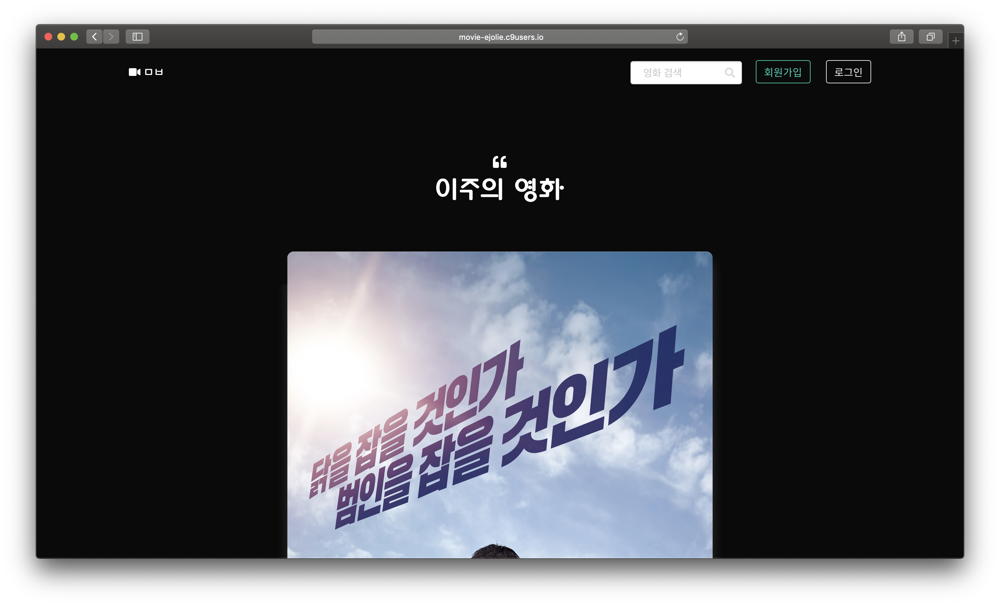
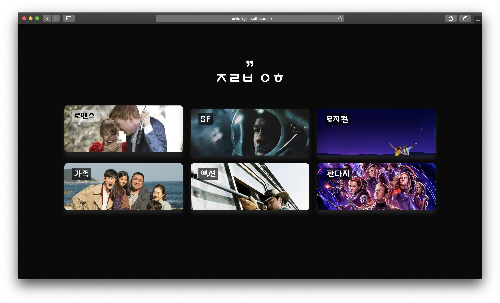
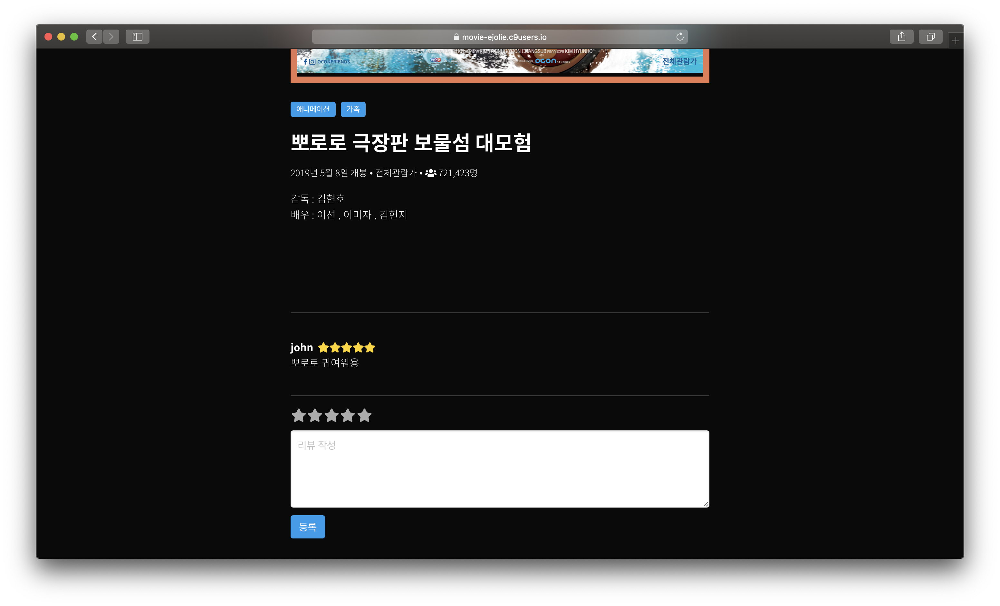
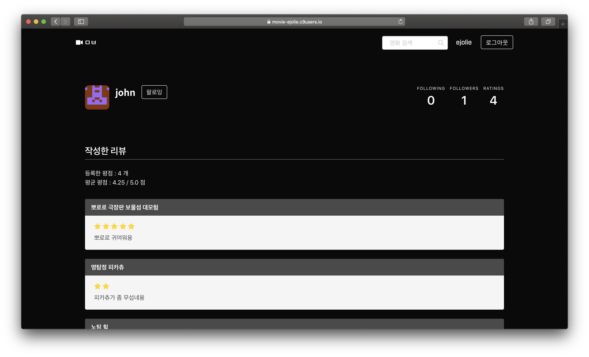

# 🎞 미음비읍

SSAFY 마지막 프로젝트를 위한 영화 포털 사이트입니다.


&nbsp;
## 0. 로컬 실행 방법

pip로 프로젝트에 필요한 패키지를 설치합니다.

```bash
> pip install -r requirements.txt
```

migrate를 한 뒤 Django 프로젝트를 실행합니다.

```bash
> python manage.py migrate
> python manage.py runserver
```

&nbsp;
## 1. 업무 분담

서지욱 : DB / 장고 REST API 설계, 장고 로직 구현, Vue 로직 구현

박은정 : 화면 설계 및 디자인, Vue 로직 구현, REST API 활용

&nbsp;


## 2. 사용 기술 및 개발 계획

### 1) 사용 기술

Django 템플릿에서 Vue CDN을 이용해 개발했습니다.

#### Frontend

- Vue : 2.6.10
- Axios : 0.18.0
- Bulma : 0.7.4
- Font Awesome : 5.8.2

#### Backend

- Django : 2.1
- Django REST framework : 3.9.4
- Python : 3.6.7

&nbsp;


### 2) 개발 계획

* 진행 기간 : 2019.05.14 - 2019.05.17
* 목표 : 영화 포털 사이트의 기본 기능을 빠르게 구현하자

&nbsp;


## 3. DB 모델링




&nbsp;

## 4. 핵심 기능

### 1) 영화 추천

- 메인 화면에서 관람객 수 1위 영화 추천
- 프로필 페이지에서 팔로워들의 최애 영화 추천


### 2) 리뷰 작성

* 로그인한 유저는 :star: 를 조작해 평점과 리뷰 등록
* 내가 남긴 리뷰 수정, 삭제 기능


### 3) 영화 검색

* 상단 Nav 바에 있는 Search bar에서 영화명으로 영화 검색
* 메인 화면에서 장르 카드를 눌러 장르별 영화 검색 


### 4) 유저 프로필

* 내가 작성한 평점과 리뷰 확인
* 내 팔로워들의 최애 영화 확인


### 5) UI/UX

- Bulma 프레임워크를 이용해 플랫폼에 최적화된 디자인 구현
- Single Page App으로 페이지 리로드 최소화 (ex. 장르별 영화)


&nbsp;

## 5. 배포

~~[Demo](https://movie-ejolie.c9users.io/)~~

~~Cloud9을 이용해 임시 배포했습니다.~~


### 스크린샷










